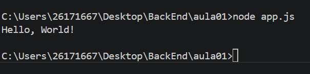

# Meu primeiro projeto JavaScript
## 🐨Aluna Mel
---

## Sobre

Este projeto foi desenvolvido durante a primeira aula de JavaScript.

O objetivo foi aprender:
- Utilizar o VS code;
- executar o JavaScript com Node.js
- utilizar o Terminal
- criar documento utilizando Markdown

---

## 🐨Estruturas 
```
MeuPrimeiroProjetoJavaScript
|
|-app.js
|-informações.js
|-operadores.js
|-variavel.js
|-readme.js
|-images.js

```
## Como executar
```bash
    node app.js
```
## Código
``` javascript
    console.log("Olá, mundo);
```

## Resultado


## Tecnologia
- JavaScript
- Node.js
- VisualStudio Code
- Markdown

## O que aprendi 
- Criar arquivo JavaScript.
- Executar programas.
- Utilizar terminal
- Criar README.
- Instalar extensões.
- Utilizar o Markdown.
- GIT
- Variável
- Operadores